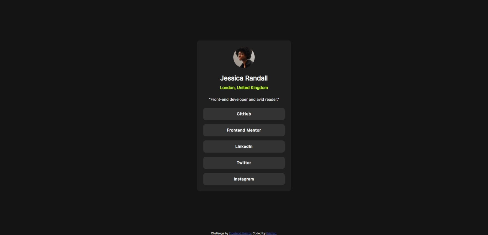

# Frontend Mentor - Social links profile solution

This is a solution to the [Social links profile challenge on Frontend Mentor](https://www.frontendmentor.io/challenges/social-links-profile-UG32l9m6dQ). Frontend Mentor challenges help you improve your coding skills by building realistic projects.

## Table of contents

- [Overview](#overview)
  - [The challenge](#the-challenge)
  - [Screenshot](#screenshot)
  - [Links](#links)
- [My process](#my-process)
  - [Built with](#built-with)
  - [What I learned](#what-i-learned)
- [Author](#author)

## Overview

### The challenge

Users should be able to:

- See hover and focus states for all interactive elements on the page

### Screenshot



### Links

- Solution URL: [Add solution URL here](https://your-solution-url.com)
- Live Site URL: [Add live site URL here](https://your-live-site-url.com)

## My process

### Built with

- Semantic HTML5 markup

### What I learned

With this challenged I learned how to style list elements ol and il. I also learned how to use :last-child to style the last element in a list.

```css
.social-links li:last-child {
  margin-bottom: 0px;
}
```

## Author

- Frontend Mentor - [@AshesOfPhoenix](https://www.frontendmentor.io/profile/AshesOfPhoenix)
- Twitter - [@ItsKrisKriz](https://www.twitter.com/ItsKrisKriz)
